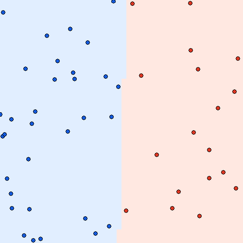
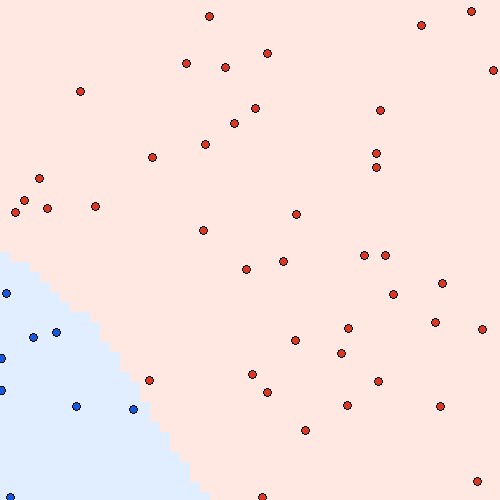
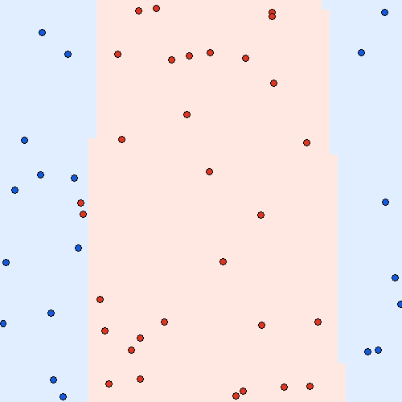
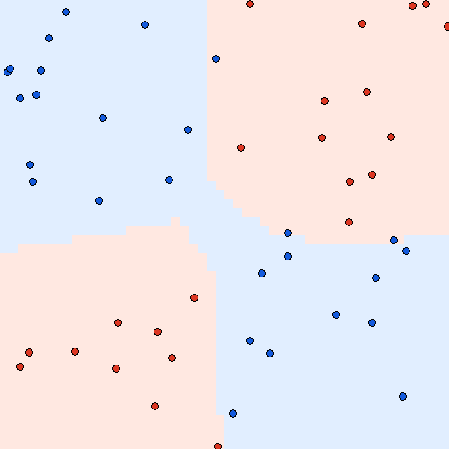

# MiniTorch Module 2


* Docs: https://minitorch.github.io/

* Overview: https://minitorch.github.io/module2/module2/

This assignment requires the following files from the previous assignments. You can get these by running

```bash
python sync_previous_module.py previous-module-dir current-module-dir
```

The files that will be synced are:

        minitorch/operators.py minitorch/module.py minitorch/autodiff.py minitorch/scalar.py minitorch/module.py project/run_manual.py project/run_scalar.py

## task 2.5

same setup here: 50 points, 10 hidden units, rate 0.5 and 500 epochs:

```text
Simple  loss=0.484854  correct=50/50  0.29703 sec/epoch
Diag    loss=0.327870  correct=50/50  0.29883 sec/epoch
Split   loss=3.483460  correct=48/50  0.29969 sec/epoch
XOR     loss=4.994969  correct=47/50  0.29697 sec/epoch
```





